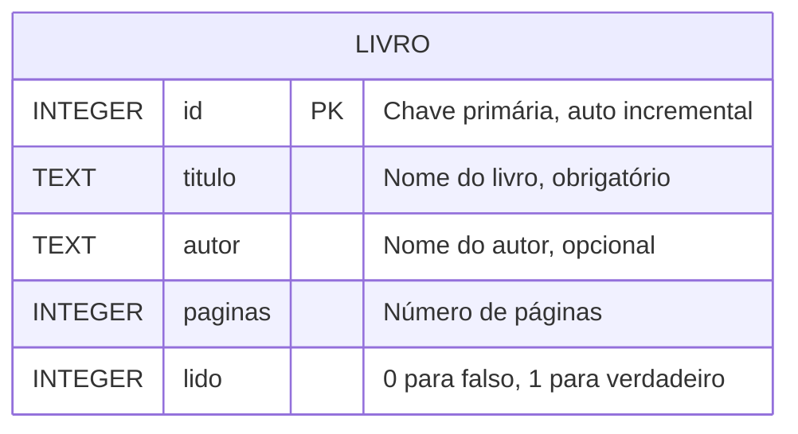

# 📘 Lição 2 — Conceitos Fundamentais e Modelagem

## 🎯 Objetivo desta lição

Compreender como os dados são organizados dentro de um Banco de Dados Relacional e como planejar essa estrutura antes de começar a codar.

---

## O que é um Banco de Dados Relacional?

Lembra daquela planilha do Excel super organizada? Um Banco de Dados Relacional funciona quase da mesma forma. A palavra **relacional** significa que armazenamos dados em **Tabelas** que podem se "relacionar" umas com as outras (ex: uma tabela de Livros se relaciona com uma tabela de Categorias).

Para entender um banco relacional, precisamos conhecer 4 conceitos básicos:

### 1. Tabela
Representa uma **entidade** do mundo real.
*Exemplo:* No nosso projeto teremos uma Tabela chamada `livros`.

### 2. Coluna
Define uma **característica** daquela entidade. Todas as colunas possuem um tipo específico (ex: texto, número).
*Exemplo:* As colunas da tabela livros serão `titulo` e `lido`.

### 3. Linha (Registro)
Representa um **item real e único** dentro da tabela. 
*Exemplo:* O livro "Harry Potter" inteiro ocupará uma única linha na tabela.

### 4. Chave Primária (Primary Key - PK)
É um identificador **único e exclusivo** para cada linha. Nunca haverão duas linhas com a mesma Chave Primária.
*Exemplo:* O nosso velho conhecido `id`. Sem ele, se tivermos dois livros chamados "Dom Casmurro", não saberemos qual deles deletar!

---

## Os Tipos de Dados no SQLite

No JavaScript, nós não nos preocupamos muito com tipos. Declaramos variáveis com `let` ou `const` e colocamos o que quisermos dentro. No Banco de Dados as regras são **rígidas**.

No **SQLite**, as nossas colunas podem ter os seguintes tipos:
- **INTEGER**: Números inteiros (como o `id` ou número de páginas). Também usamos para Booleanos (`0` para falso, `1` para verdadeiro (em outros bancos de dados temos o tipo **BOOLEAN**)).
- **TEXT**: Textos em geral (como o `titulo` e `autor`).
- **REAL**: Números decimais ou quebrados (ex: `preco` 29.99).
- **NULL**: Indica a ausência de um valor (quando não preenchemos aquele dado).

---

## Modelagem de Dados: Pensar antes de codar

Antes de abrir o terminal ou o editor de código para criar nosso banco, nós precisamos desenhar a nossa tabela e definir exatamente quais informações ela vai guardar. Isso é o que chamamos de **Modelagem de Dados**.

Na verdade, **você já sabe fazer isso!** 
No [Mini Curso de Modelagem de Dados](../../docs/modelagem-de-dados/01-introducao-modelagem-de-dados.md), você exercitou exatamente a mentalidade necessária para pensar em entidades, propriedades e relações. Você construiu "Diagramas de Entidade-Relacionamento" (Diagrama ER) só não sabia o nome chique para isso!

Fazendo a modelagem da nossa **Estante Virtual**, o nosso diagrama final da tabela de livros ficará assim:



É muito melhor você descobrir que esqueceu de planejar a coluna "autor" agora, desenhando no papel, do que descobrir isso quando o código backend já estiver gigante.

---

## ✍️ Mini-exercício

Pegue um papel e caneta (ou use um bloco de notas simples).
Tente modelar (desenhar) como seria uma Tabela de `usuarios` para a Estante Virtual.

- Quais seriam as colunas?
- Qual seria o tipo de dado (INTEGER, TEXT, etc) de cada coluna?
- Qual coluna seria a Chave Primária (Primary Key)?

*Resposta (spoiler)*:
<details>
<summary>Clique aqui para ver uma modelagem possível</summary>

```text
Tabela: usuarios
- id (INTEGER, Chave Primária)
- nome (TEXT)
- email (TEXT)
- senha (TEXT)
- idade (INTEGER)
```
</details>

---

## Próxima lição

[Lição 3 — SQLite e Ferramentas Visuais na Prática →](./03-sqlite-na-pratica.md)
