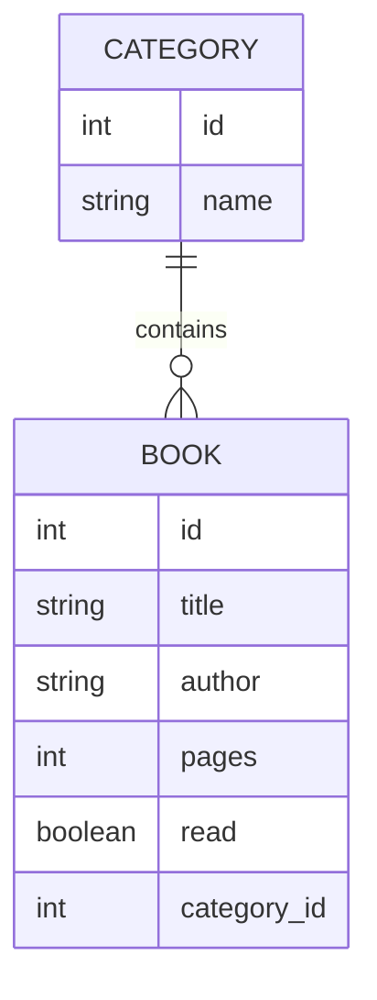

# Semana 8 – Banco de Dados Relacional com SQLite

**Transformando a Estante Virtual em um sistema persistente**

- [📺 Codecademy — Intro to SQL](https://www.codecademy.com/learn/intro-to-sql)
- [📺 Codecademy — Design Databases (PostgreSQL)](https://www.codecademy.com/learn/paths/design-databases-with-postgresql)
- [📺 SQL Explained in 100 Seconds](https://www.youtube.com/watch?v=zsjvFFKOm3c)

---

## 🎯 Objetivo da semana

Ao final desta semana, você será capaz de:

- Entender o que é um banco de dados relacional
- Compreender profundamente os conceitos de tabela, coluna, linha e chave primária
- Modelar dados antes de codar
- Criar relações entre entidades (Livro ↔ Categoria)
- Usar SQLite como banco de dados
- Manipular dados com SQL (CRUD)
- Visualizar dados usando uma ferramenta gráfica
- Reconhecer que este problema já foi resolvido antes, apenas em outro formato

---

## 🧠 Conceito central da semana

> Nada muda conceitualmente.
> Só muda onde os dados vivem.

Na Semana 1:

- dados em arrays
- livros como objetos
- funções manipulando dados

Agora:

- dados em tabelas
- livros como registros
- funções executando SQL

O CRUD é o mesmo.

---

## 1️⃣ O que é um banco de dados relacional?

Um banco de dados relacional é um sistema usado para armazenar, organizar e recuperar dados de forma estruturada, utilizando relações entre informações.

Ele resolve problemas como:

- perda de dados ao reiniciar o sistema
- dificuldade de organização
- falta de consistência
- impossibilidade de múltiplos acessos

É chamado de relacional porque os dados são organizados em tabelas que podem se relacionar entre si.

---

## 2️⃣ Conceitos fundamentais

### 2.1 Tabela

Representa uma entidade do mundo real (ex: livros, categorias).

### 2.2 Coluna

Define uma característica da entidade (ex: título, autor).

### 2.3 Linha (registro)

Representa um item real dentro da tabela.

### 2.4 Chave primária

Identificador único de cada registro.
Sem ela não é possível atualizar, remover ou relacionar dados corretamente.

---

## 2.5 Tipos de dados em SQLite

- INTEGER → IDs, contadores, booleanos (0 ou 1)
- TEXT → textos em geral
- REAL → números decimais
- NULL → ausência de valor

---

## 3️⃣ Modelagem de dados

Modelar dados é pensar na estrutura antes de implementar.

Perguntas-chave:

- Quais entidades existem?
- Como se relacionam?
- O que depende do quê?

---

### 3.1 Diagrama ER



---

## 4️⃣ O que é SQLite?

SQLite é um banco de dados relacional baseado em arquivo.

- o banco inteiro é um arquivo `.db`
- não existe servidor
- simples de usar
- ideal para aprendizado

---

### 4.1 Ferramenta visual: DB Browser for SQLite

Ferramenta obrigatória nesta semana.

Permite:

- criar tabelas
- rodar SQL
- visualizar dados
- validar se o código funcionou

---

## 5️⃣ Manipulação de dados com SQL (CRUD)

Você não precisa decorar SQL.
O objetivo é entender o que cada comando faz.

---

### Criar tabelas

```sql
CREATE TABLE books (
  id INTEGER PRIMARY KEY AUTOINCREMENT,
  title TEXT NOT NULL,
  author TEXT,
  pages INTEGER,
  read INTEGER DEFAULT 0,
  category_id INTEGER
);
```

---

### Inserir dados (CREATE)

```sql
INSERT INTO books (title, author, pages, read)
VALUES ('Dom Casmurro', 'Machado de Assis', 256, 1);
```

---

### Buscar dados (READ)

```sql
SELECT * FROM books;
```

Com filtro:

```sql
SELECT * FROM books WHERE id = 1;
```

---

### Atualizar dados (UPDATE)

```sql
UPDATE books
SET read = 1
WHERE id = 1;
```

---

### Remover dados (DELETE)

```sql
DELETE FROM books WHERE id = 1;
```

---

### A importância do WHERE

O WHERE define quais registros serão afetados.

Nunca use UPDATE ou DELETE sem pensar no WHERE.

---

### Usando IA como apoio

Exemplo de prompt:

"Gere um comando SQL para SQLite para criar uma tabela de livros com id auto incremental e chave primária, título obrigatório em texto, autor opcional, páginas como número e campo lido booleano com valor padrão falso."

---

## 6️⃣ Conexão com o que você já sabe

| Antes (JS) | Agora (SQL) |
| ---------- | ----------- |
| array      | tabela      |
| objeto     | linha       |
| filter     | WHERE       |
| reduce     | COUNT / SUM |

---

## 🏁 Conclusão

Você agora consegue:

- modelar dados
- persistir informações
- visualizar o banco
- conectar backend e dados

Esta é a base real de uma aplicação full stack.
